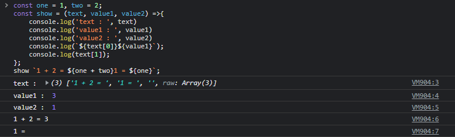

# 6. 데이터 타입 & 7. 연산자

### 6.0 개요

- ES6는 7개의 데이터 타입을 제공한다.
- 원시타입
  1. 숫자타입
  2. 문자열타입
  3. 불리언타입
  4. undefined 타입
  5. null 타입
  6. symbol 타입
- 객체 타입
  1. 객체 타입

### 6.1 숫자 타입

- 자바스크립트엔 하나의 숫자 타입만 존재한다.
- 숫자 타입은 모두 실수로 처리된다.

```jsx
console.log(1 === 1.0); // true
```

```jsx
// 숫자 타입의 세 가지 특별한 값
console.log(10 / 0); // Infinity
console.log(10 / -0); // -Infinity
console.log(1 * "String"); //NaN
```

### 6.2 문자열 타입

- 자바스크립트의 문자열은 원시 타입이며 변경 불가능한 값이다.

### 6.3 템플릿 리터럴

- ES6 부터 템플릿 리터럴 이라고 하는 문자열 표기법이 도입되었다.
- 템플릿 리터럴은 백틱(` `)을 사용해 표현한다.

```jsx
var template = `template literal`;
```

- 템플릿 리터럴은 줄바꿈, 표현식 삽입, tagged Template등을 편리한 문자열 처리 기능을 제공한다.
- tagged template
  - 템플릿에 함수 이름을 작성한 형태를 tagged Template라 하는데 여기서 호출되는 함수를 태그함수(tag function)이라 부릅니다.
  ```jsx
  const one = 1,
    two = 2;
  const show = (text, value) => {
    console.log(`${text[0]}${value}`);
    console.log(text[1]);
  };
  show`1 + 2 = ${one + two}`;
  ```
    
    
    1. Template에서 문자열과 표현식을 분리한다.
    2. 위 예제에서 `“1 + 2 =”` , “`1 = “`이 문자열, `${one + two}` , `${one}`가 표현식이다.
    3. show() 함수를 호출한다.
    4. 문자열을 배열로 넘겨준다. 좌측 ⇒ 우측으로 배열 엘리먼트에 추가하며 최종적으로 빈 문자열을 엘리멘트에 추가한다. 단, 템플릿 끝에 문자열이 있다면 빈 문자열은 추가되지 않는다.
        - `[’1 + 2 = ‘, ‘1 = ‘, ‘’]`
    5. 표현식의 평가 결과를 넘겨준다.
        - `value1 : 3`
        - `value2 : 1`

### 6.3+ tagged template와 styled-components

- tagged template 생소해보이지만 styled-components를 사용하고 있다면 밥먹듯이 쓰고 있던 표기법이다.
- styled-components의 근간이 tagged template이므로…
- 아래 예제를 살펴보자.

---

- styled-components는 각각 DOM 노드에 해당하는 헬퍼 메서드 컬렉션을 제공한다.
- DOM 노드는 h1, 헤더, 버튼 및 기타 수십 가지가 있다(line 및 path와 같은 SVG 요소도 지원합니다!).
- 헬퍼 메서드는 "태그드 템플릿 리터럴"로 알려진 모호한 JavaScript 기능을 사용하여 CSS 덩어리로 호출된다.

```jsx
const Title = styled.h1(`
  font-size: 1.5em;
  text-align: center;
  color: palevioletred;
`);
```

---

- h1은 스타일드 컴포넌트의 헬퍼 메서드이며 단일 인수인 스트링으로 호출된다.
- 헬퍼 메서드는 작은 컴포넌트 팩토리다.
- 호출할 때마다 완전히 새로운 React 컴포넌트를 생성한다.

이것을 스케치 보면…

```jsx
// When I call this function…
function h1(styles) {
  // …it generates a brand-new React component…
  return function NewComponent(props) {
    // …which will render the associated HTML element:
    return <h1 {...props} />;
  };
}
```

---

**const Title = styled.h1(...)을 실행하면 **NewComponent\*\* 컴포넌트가 Title 상수에 할당된다. 그리고 앱에서 Title 컴포넌트를 렌더링하면 DOM 노드가 생성된다.

**Title 컴포넌트를 렌더링할 때 몇 가지 일이 발생한다.**

- 스타일을 dKamQW 또는 iOacVe와 같이 무작위로 보이는 문자열로 해싱하여 고유한 클래스 이름을 만든다.
- 경량 CSS 전처리기\*인 Stylis를 통해 CSS를 실행한다.
  - less, sass와 같이 벤더 프리픽스를 처리하고, 몇가지 웹의 다루기 어려운 문제를 자동으로 해결해준다.
- 해시된 문자열을 이름으로 사용하고 스타일 문자열의 모든 CSS 선언을 포함하는 새 CSS 클래스를 페이지에 삽입한다.
- 반환된 HTML 엘리먼트에 해당 클래스 명을 적용한다.

코드로 보면 다음과 같다.

```jsx
function h1(styles) {
  return function NewComponent(props) {
    const uniqueClassName = comeUpWithUniqueName(styles);
    const processedStyles = runStylesThroughStylis(styles);
    createAndInjectCSSClass(uniqueClassName, processedStyles);
    return <h1 className={uniqueClassName} {...props} />;
  };
}
```

---

**<Title>Hello World</Title>**을 렌더링하면 결과 HTML은 다음과 같이 보일 것이다.

```xml
<style>
  .dKamQW {
    font-size: 1.5em;
    text-align: center;
    color: palevioletred;
  }
</style>
<h1 class="dKamQW">Hello World</h1>
```

**실제 styled-components 코드베이스는 이보다 훨씬 더 복잡하다,,,**

### 6.4 불리언 타입

- true와 false

### 6.5 undefined 타입

```jsx
var a;
let b;

console.log(a, b);
// undefined undefined
```

- var, let 키워드로 선언한 변수는 암묵적으로 undefined로 초기화된다.
- 변수 참조 시 undefined가 반환된다면 선언 이후 값이 할당된 적이 없는 변수임을 간파할 수 있다.
- **undefined를 의도적으로 할당하는 것은 본래 취지에 부합하지 않는다.**
- **변수에 값이 없음을 명시하고 싶을 땐 null을 할당하자.**

### 6.6 null 타입

- null은 변수에 값이 없음을 의도적으로 명시할 때 사용한다.
- 함수가 유효한 값을 반환할 수 없을 경우 명시적으로 null을 반환하기도 한다

### 6.7 symbol 타입

- symbol은 es6에서 추가된 7번째 타입으로 변경 불가능한 원시 타입의 값이다.
- symbol값은 다른 값과 중복되지 않는 유일무이한 값으로, **객체의 유일한 프로퍼티 키를 만들기 위해 사용한다.**

### 6.8 객체 타입

- 위 7개의 원시 타입 이외의 모든 값은 객체 타입이다.

### 6.9 데이터 타입의 필요성

1. 값을 저장할 때 확보해야 하는 메모리 공간의 크기를 결정하기 위해
2. 값을 참조할 때 한 번에 읽어 들여야 할 메모리 공간의 크기를 결정하기 위해
3. 메모리에서 읽어 들인 2진수를 어떻게 해석할지 결정하기 위해

### 6.10 동적 타이핑

- 자바스크립트의 변수는 선언이 아닌 할당에 의해 타입이 결정(타입 추론)된다. 그리고 재할당에 의해 변수의 타입은 언제든지 동적으로 변할 수 있다.
- 이러한 특징을 동적 타이핑이라 하며, 자바스크립트를 동적 타입 언어라 한다.
- 동적 타입 언어 : 자바스크립트, 파이썬, 루비, PHP 등등

---

### 7.1 산술 연산자

- 수학적 계산을 수행해 새로운 숫자 값을 만든다.
- 산술 연산이 불가능한 경우, `NaN`을 반환한다.

### 7.1.1 이항 산술 연산자

- 2개의 피연산자를 산술 연산하여 숫자 값을 만든다.

| 이항 산술 연산자 | 의미   | 부수 효과 |
| ---------------- | ------ | --------- |
| +                | 덧셈   | X         |
| -                | 뺄셈   | X         |
| \*               | 곱셈   | X         |
| /                | 나눗셈 | X         |
| %                | 나머지 | X         |

### 7.1.2 단항 산술 연산자

- 1개의 피연산자를 산술 연산하여 숫자 값을 만든다.
- 증가/감소(++/--) 연산자는 피연산자의 값을 변경하는 부수 효과가 있다.
- `+` / `-` 단항 연산자를 사용하면 피연산자를 숫자 타입으로 변환하여 반환한다. (숫자 타입으로 변환할 수 없으면 `NaN`을 반환한다.)

| 단항 산술 연산자 | 의미                                               | 부수 효과 |
| ---------------- | -------------------------------------------------- | --------- |
| ++               | 증가                                               | O         |
| --               | 감소                                               | O         |
| +                | 어떠한 효과도 없다.                                | X         |
| -                | 양수를 음수로, 음수를 양수로 반전한 값을 반환한다. | X         |

💡 위치에 따른 증가/감소(++/--) 연산자

1. 전위 증가/감소 연산자: 피연산자의 값을 먼저 증가/감소시킨 후, 다른 연산을 수행한다.
2. 후위 증가/감소 연산자: 먼저 다른 연산을 수행한 후, 피연산자의 값을 증가/감소시킨다.

```jsx
var x = 5;
var result;

// 선할당 후증가
result = x++;
console.log(result, x); // 5 6

//선증가 후할당
result = ++x;
console.log(result, x); // 7 7

// 선할당 후감소
result = x--;
console.log(result, x); // 7 6

// 선감소 후할당
result = --x;
console.log(result, x); // 5 5
```

### 7.1.3 문자열 연결 연산자

- `+` 연산자는 피연산자 중 하나 이상이 문자열인 경우 문자열 연결 연산자로 동작한다.

❓ 암묵적 타입 변환: 자바스크립트 엔진은 암묵적으로 불리언 타입의 값을 숫자 타입으로 강제로 변환한 후 연산을 수행한다.　　 true => 1, false => 0

### 7.2 할당 연산자

- 할당 연산자는 우항에 있는 피연산자의 결과를 좌항에 있는 변수에 할당한다.
- 좌항의 변수에 값을 할당하므로 변수 값이 변하는 부수 효과가 있다.
- 할당문은 값으로 평가되는 표현식인 문으로서 할당된 값으로 평가된다.

| 할당 연산자 | 예      | 동일 표현  | 부수 효과 |
| ----------- | ------- | ---------- | --------- |
| =           | x = 5   | x = 5      | O         |
| +=          | x += 5  | x = x + 5  | O         |
| -=          | x -= 5  | x = x - 5  | O         |
| \*=         | x \*= 5 | x = x \* 5 | O         |
| /=          | x /= 5  | x = x / 5  | O         |
| %=          | x %= 5  | x = x % 5  | O         |

### 7.3 비교 연산자

- 비교 연산자는 좌항과 우항의 피연산자를 비교한 다음 그 결과를 불리언 값으로 반환한다.

### 7.3.1 동등/일치 비교 연산자

| 비교 연산자 | 의미        | 사례    | 설명                     | 부수 효과 |
| ----------- | ----------- | ------- | ------------------------ | --------- |
| ==          | 동등 비교   | x == y  | x와 y의 값이 같음        | X         |
| ===         | 일치 비교   | x === y | x와 y의 값과 타입이 같음 | X         |
| !=          | 부동등 비교 | x != y  | x와 y의 값이 다름        | X         |
| !==         | 부일치 비교 | x !== y | x와 y의 값과 타입이 다름 | X         |

- 동등 비교 연산자는 좌항과 우항의 피연산자를 비교할 때 먼저 암묵적 타입 변환을 통해 타입을 일치시킨 후 값은 값인지 비교한다.
- 일치 비교 연산자는 좌항과 우항의 피연산자가 타입도 같고 값도 같아야 `true`를 반환한다.

💡 일치 비교 연산자의 주의점

- 일치 비교 연산자에서 `NaN`은 자신과 일치하지 않는 유일한 값으로 `false`를 반환한다.(숫자가 `NaN`인지 조사하려면 `Number.isNaN()`을 사용)
- 양의 0과 음의 0을 비교하면 `true`를 반환한다.

### 7.3.2 대소 관계 비교 연산자

- 피연산자의 크기를 비교하여 불리언 값을 반환한다.

| 대소 관계 비교 연산자 | 예제   | 설명                  | 부수 효과 |
| --------------------- | ------ | --------------------- | --------- |
| >                     | x > y  | x가 y보다 크다        | X         |
| <                     | x < y  | x가 y보다 작다        | X         |
| >=                    | x >= y | x가 y보다 크거나 같다 | X         |
| <=                    | x <= y | x가 y보다 작거나 같다 | X         |

### 7.4 삼항 조건 연산자

- 삼항 조건 연산자는 조건식의 평가 결과에 따라 반환할 값을 결정한다.
- 삼항 조건 연산자 표현식은 값으로 평가할 수 있는 표현식인 문이다.
- `조건식 ? 조건식이 true일 때 반환할 값 : 조건식이 false일 때 반환할 값`

### 7.5 논리 연산자

- 논리 연산자는 우항과 좌항의 피연산자를 논리 연산한다.

| 논리 연산자 | 의미        | 부수 효과 |
| ----------- | ----------- | --------- |
| ll          | 논리합(OR)  | X         |
| &&          | 논리곱(AND) | X         |
| !           | 부정(NOT)   | X         |

### 7.6 쉼표 연산자

- 쉼표 연산자는 왼쪽 피연산자부터 차례대로 평가하고 마지막 피연산자의 평가가 끝나면 마지막 피연산자의 평가 결과를 반환한다.

```jsx
var x, y, z;
(x = 1), (y = 2), (z = 3); // 3
```

### 7.7 그룹 연산자

- 소괄호로 감싸진 표현식을 가장 먼저 평가한다.
- 연산자의 우선순위를 조절할 수 있다.

```jsx
console.log(10 * 2 + 3); //23

// 그룹 연산자를 사용하여 우선순위를 조절
console.log(10 * (2 + 3)); //50
```

### 7.8 typeof 연산자

- typeof 연산자는 피연산자의 데이터 타입을 문자열로 반환한다.
- `null`을 반환하는 경우는 없으며, 함수의 경우 `function`을 반환한다.

💡 typeof 연산자의 주의점

1. typeof 연산자로 `null`값을 연산해 보면 `object`를 반환하기에 일치 연산자(===)를 사용한다.
2. 선언하지 않은 식별자를 연산해 보면 `ReferenceError`가 발생하지 않고 `undefined`를 반환한다.

### 7.9 지수 연산자

- ES7에서 도입된 지수 연산자는 좌항의 피연산자를 밑으로, 우항의 피연산자를 지수로 거듭 제곱하여 숫자 값을 반환한다.
- 지수 연산자가 도입되기 이전에는 `Math.pow()`메서드를 사용했다.
- 음수를 거듭제곱의 밑으로 사용하기 위해서는 괄호로 묶어주어야 한다.
- 지수 연산자는 이항 연산자 중에서 우선순위가 가장 높다.

👀 그 외의 연산자: ?., ??, delete, new, instanceof, in ...

### 7.11 연산자의 부수 효과

- 연산자가 다른 코드에 영향을 주는 효과
- 부수 효과가 있는 연산자는 할당 연산자, 증가/감소 연산자, delete 연산자다.

### 7.12 연산자 우선순위

- 연산자의 우선순위가 높을수록 먼저 실행된다.
- 연산자는 종류가 많아 우선순위를 모두 기억하기 어렵고 실수하기도 쉽기 때문에 가장 우선순위가 높은 그룹 연산자를 사용하여우선순위를 명시적으로 조절하도록 하자!

### 7.13 연산자 결합 순서

- 연산자의 어느 쪽(좌항 또는 우항)부터 평가를 수행할 것인지를 나타내는 순서를 말한다.

| 결합 순서    | 연산자                                                                                              |
| ------------ | --------------------------------------------------------------------------------------------------- |
| 좌항 => 우항 | +, -, /, %, <, <=, >, >=, &&, ll, ., [], (), ??, ?., in, instanceof                                 |
| 우항 => 좌항 | ++, --, 할당 연산자(=, +=, -=, ...), !x, +x, -x, ++x, --x, typeof, delete, 삼항 연산자, 지수 연산자 |
