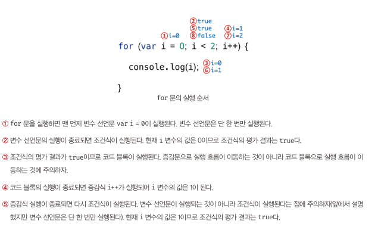

# 8. 제어문 & 9. 타입변환과 단축평가

## 8.1 블록문

- 0개 이상의 문을 중괄호로 묶은 것
- 문의 끝에는 세미콜론을 붙이는 것이 일반적이다.
- 하지만 블록문은 자체 종결성을 갖기 때문에 블록문의 끝에는 세미콜론을 붙이지 않는다.

```jsx
// 블록문
{
  var foo = 10;
}

// 제어문
var x = 1;
if (x < 10) {
  x++;
}

// 함수 선언문
function sum(a, b) {
  return a + b;
}
```

## 8.2 조건문

- if … else 문과 switch 문으로 두 가지 조건문을 제공한다.

### **if … else 문**

```jsx
var num = 2;
var kind;

// if 문
if (num > 0) {
  kind = "양수"; // 음수를 구별할 수 없다
}
console.log(kind); // 양수

// if...else 문
if (num > 0) {
  kind = "양수";
} else {
  kind = "음수"; // 0은 음수가 아니다.
}
console.log(kind); // 양수

// if...else if 문
if (num > 0) {
  kind = "양수";
} else if (num < 0) {
  kind = "음수";
} else {
  kind = "영";
}
console.log(kind); // 양수
```

- **만약 코드 블록 내의 문이 하나뿐이라면 중괄호를 생략할 수 있다.**

```jsx
var num = 2;
var kind;

if (num > 0) kind = "양수";
else if (num < 0) kind = "음수";
else kind = "영";

console.log(kind); // 양수
```

- **if … else 문은 삼항 조건 연산자로 바꿔 쓸 수 있다.**

```jsx
// x가 짝수이면 result 변수에 문자열 '짝수'를 할당하고, 홀수이면 문자열 '홀수'를 할당한다.
var x = 2;
var result;

if (x % 2) {
  // 2 % 2는 0이다. 이때 0은 false로 암묵적 강제 변환된다.
  result = "홀수";
} else {
  result = "짝수";
}

console.log(result); // 짝수
```

```jsx
var x = 2;

// 0은 false로 취급된다.
var result = x % 2 ? "홀수" : "짝수";
console.log(result); // 짝수
```

### switch 문

- switch 문은 주어진 표현식을 평가하여 그 값과 일치하는 표현식을 갖는 case 문으로 실행 흐름을 옮긴다.

```jsx
// 월을 영어로 변환한다. (11 → 'November')
var month = 11;
var monthName;

switch (month) {
  case 1:
    monthName = "January";
    break;
  case 2:
    monthName = "February";
    break;
  case 3:
    monthName = "March";
    break;
  case 4:
    monthName = "April";
    break;
  case 5:
    monthName = "May";
    break;
  case 6:
    monthName = "June";
    break;
  case 7:
    monthName = "July";
    break;
  case 8:
    monthName = "August";
    break;
  case 9:
    monthName = "September";
    break;
  case 10:
    monthName = "October";
    break;
  case 11:
    monthName = "November";
    break;
  case 12:
    monthName = "December";
    break;
  default:
    monthName = "Invalid month";
}

console.log(monthName); // November
```

- 조건이 너무 많아서 if … else 문보다 switch 문을 사용했을 때 가독성이 더 좋은 경우엔 switch문을 사용하는 편이 좋다.

## 8.3 반복문

### for문



### while문

```jsx
var count = 0;

// 무한루프
while (true) {
  console.log(count);
  count++;
  // count가 3이면 코드 블록을 탈출한다.
  if (count === 3) break;
} // 0 1 2
```

### do … while문

```jsx
var count = 0;

// count가 3보다 작을 때까지 코드 블록을 계속 반복 실행한다.
do {
  count++;
  console.log(count);
} while (count < 3); // 0 1 2 3
```

# 8.4 break 문

- break 문은 레이블 문, 반복문, switch 문의 코드 블록을 탈출한다.
- 레이블 문이란 식별자가 붙은 문을 말한다.

```jsx
// outer라는 식별자가 붙은 레이블 for 문
outer: for (var i = 0; i < 3; i++) {
  for (var j = 0; j < 3; j++) {
    // i + j === 3이면 outer라는 식별자가 붙은 레이블 for 문을 탈출한다.
    if (i + j === 3) break outer;
    console.log(`inner [${i}, ${j}]`);
  }
}

console.log("Done!");
```

- 중첩된 for 문의 내부 for 문에서 break 문을 실행하면 내부 for 문을 탈출하여 외부 for 문으로 진입한다. 이때 내부 for문이 아닌 외부 for 문을 탈출하려면 레이블 문을 사용해야 한다.
- 레이블 문은 중첩된 for 문 외부로 탈출할 때 유용하지만 그 밖의 경우에는 일반적으로 권장하지 않는다. 레이블 문을 사용하면 프로그램 흐름이 복잡해져 가독성이 나빠지고 오류를 발생시킬 가능성이 높아지기 때문이다.

# 8.5 continue 문

- continue 문은 반복문의 코드 블록 실행을 현 지점에서 중단하고 반복문의 증감식으로 실행 흐름을 이동시킨다. break 문처럼 반복문을 탈출하지는 않는다.
- 다음은 문자열에서 특정 문자의 개수를 세는 예다.

```jsx
var string = "Hello World.";
var search = "l";
var count = 0;

// 문자열은 유사배열이므로 for 문으로 순회할 수 있다.
for (var i = 0; i < string.length; i++) {
  // 'l'이 아니면 현 지점에서 실행을 중단하고 반복문의 증감식으로 이동한다.
  if (string[i] !== search) continue;
  count++; // continue 문이 실행되면 이 문은 실행되지 않는다.
}

console.log(count); // 3

// 참고로 String.prototype.match 메서드를 사용해도 같은 동작을 한다.
const regexp = new RegExp(search, "g");
console.log(string.match(regexp).length); // 3
```

---

## 9.1 타입 변환이란?

JS의 모든 값은 타입이 있다. 이는 개발자의 의도에 따라 다른 타입으로 변환할 수 있고 이를 명시적 타입 변환explicit coercion 또는 타입 캐스팅type casting이라 한다.

```jsx
var x = 10;

var str = x.toString();
console.log(typeof str, str); // string 10
console.log(typeof x, x); // number 10
```

또는 개발자의 의도와는 상관없이 표현식을 평가하는 도중에 자바스크립트 엔진에 의해 암묵적으로 타입이 자동 변환되기도 하는 데 이를 암묵적 타입 변환implicit coercion 또는 타입 강제 변환type coercion이라 한다.

```jsx
var str = x + "";
console.log(typeof str, str); // string 10
```

두 가지 경우 모두 기존 원시 값(`x`)을 직접 변경하는 것은 아니다.(원시 값은 변경 불가능한 값)이를 이용해 새로운 원시 값을 생성하는 것이다.

`x + ''`을 평가하기 위해 엔진은 `x`변수의 숫자 값을 바탕으로 새로운 문자열 값 `'10'`을 생성하고 이것으로 표현식 `'10' + ''`를 평가한다. 이때 `'10'`은 변수 `x`에 재할당되지 않는다.

즉, 암묵적 타입 변환은 기존 변수 값을 재할당하여 변경하는 것이 아니다. 이를 통해 새로운 타입의 값을 만들어 단 한 번 사용하고 버리는 것이다.

어떤 것이 좋고 나쁜 것이 아니다. 다만 다른 사람의 코드를 이해하고 내 코드를 가독성 좋고 예측 가능하게 작성하려면 타입 변환에 대해 알고 있어야한다.

## **9.2 암묵적 타입 변환**

표현식을 평가할 때 문맥에 맞지 않는 코드는 언어에 따라 에러를 발생시키키도 하지만 JS는 가급적 에러를 발생시키지 않기 위해 암묵적 변환을 한다.

이때 문자열, 숫자, 불리언과 같은 원시 타입 중 하나로 자동 변환하게 된다.

## 9.**2.1 문자열 타입으로 변환**

`+`연산자를 사용할 때 피연산자 중 하나 이상이 문자열이면 문자열 연결 연산자로 동작한다. 이때 문자열 타입이 아닌 것을 암묵적 타입 변환을 통해 문자열로 변환하는 것.

```jsx
0 + '' // '0'
-0 + '' // '0'
1 + '' // '1'
-1 + '' // '-1'
NaN + '' // 'NaN'
Infinity + '' // 'Infinity'
-Infinity + '' // '-Infinity'

true + '' // 'true'
false + '' // 'false'

null + '' // 'null'

undefined + '' // 'undefined'

(Symbol()) + '' // TypeError: Cannot convert a Symbol value to a string

({}) + '' // '[object Object]'
Math + '' // '[object Math]'
[] + '' // ''
[10, 20] + '' // '10, 20'
(function(){}) + '' // 'function(){}'
Array + '' // 'function Array() { [native code] }'
```

## 9.**2.2 숫자 타입으로 변환**

산술, 비교 연산자 표현식을 평가하기 위해 피연산자 중에서 숫자 타입이 아닌 피연산자를 암묵적 타입 변환하는 것을 말한다.

이때 숫자 타입으로 변환할 수 없는 경우 표현식의 평가 결과는 `NaN`이 된다.

빈 문자열, 빈 배열, null, false는 0으로 true 는 1로 변환된다.

```jsx
+""; // 0
+"0"; // 0
+"1"; // 1
+"string"; // NaN
+true; // 1
+false; // 0
+null; // 0
+undefined; // NaN
+Symbol(); //  TypeError: Cannot convert a Symbol value to a number
+{}; // NaN
+[]; // 0
+[10, 20]; // NaN
+function () {}; // NaN

("ba" + +"a" + "a").toLowerCase(); // 'banana'
```

## 9**.2.3 불리언 타입으로 변환**

논리적 참/거짓으로 평가되어야 하는 표현식이 그렇지 않은 경우 발생하는 형변환이다.

```jsx
if ("") console.log("1");
if (true) console.log("2");
if (0) console.log("3");
if ("str") console.log("4");
if (null) console.log("5");

// 2 4
```

이때 엔진은 불리언 타입이 아닌 값을 **Truthy 값(참으로 평가되는 값) 또는 Falsy 값(거짓으로 평가되는 값)**으로 구분한다.

- Falsy 값으로 평가되는 값

1. false
2. undefined
3. null
4. 0, -0
5. NaN
6. ''

이것들을 제외한 모든 값은 Truthy한 값이다.

## 9.3 명시적 타입 변환

개발자의 의도에 따라 명시적으로 타입을 변경하는 방법은 다양하다. 표준 빌트인 생성자 함수(String, Number, Boolean)를 `new`연산자 없이 호출하는 방법과 빌드인 메서드를 사용하는 방법, 암묵적 타입 변환을 이용하는 방법이 있다.

### 9.3.1 문자열 타입으로 변환

1. String 생성자 함수를 new 연산자 없이 호출하는 방법
2. Object.prototype.toString 메서드를 사용하는 방법
3. 문자열 연결 연산자를 이용하는 방법

```jsx
String(1); // '1'
String(NaN); // 'NaN'

String(true); // 'true'
String(false); // 'false'

(1).toString(); // '1'
NaN.toString(); // 'NaN'
true.toString(); // 'true'

1 + ""; // '1'
NaN + ""; // 'NaN'
true + ""; // 'true'
```

### 9.3.2 숫자 타입으로 변환

1. Number 생성자 함수를 new 연산자 없이 호출하는 방법
2. parseInt, parseFloat 함수를 사용하는 방법(문자열만 가능)
3. - 단항 산술 연산자를 이용하는 방법
4. 산술 연산자를 이용하는 방법

```jsx
Number("0"); // 0
Number("-1"); // -1
Number("10.53"); // 10.53
Number(true); // 1

parseInt("0"); // 0
parseFloat("10.53"); // 10.53

+"0"; // 0
+"10.53"; // 10.53
+true; // 1

"0" * 1; // 0
"10.53" * 1; // 10.53
true * 1; // 1
```

### 9.3.3 불리언 타입으로 변환

1. Boolean 생성자 함수를 new 연산자 없이 호출하는 방법
2. ! 부정 논리 연산자를 두 번 사용하는 방법

```jsx
Boolean('X'); // true
Boolean(''); // false
Boolean('false'); // true

Boolean(0); // false
Boolean(1); // true
Boolean(NaN); // false
Boolean(Infinity); // true

Boolean(null); // false
Boolean(undefined); // false

Boolean({}); // true
Boolean([]); // true

!!'x' // true
!!'' // false
!!'false' // true
...
```

## 9.3.1 숫자 타입으로 변환에서 Number와 parseInt의 차이는?

```jsx
Number("11.18"); // 11.18
parseFloat("11.18"); // 11.18
parseInt("11.18"); // 11
```

우선 `parseInt`는 위 두개와 달리 정수만을 반환한다. 경우에 따라서는 `parseFloat`을 사용해야한다는 것이다.

```jsx
Number("2022.12.11"); // NaN
parseInt("2022.12.11"); // 2022
```

`parseInt`는 .전까지 2022를 반환하는 반면 `Number`는 숫자로 변환할 수 없는 문자를 만나면 `NaN`을 반환한다.

```jsx
parseInt("0b101"); // 0
Number("0b101"); // 5
```

2진수 형태의 문자열을 `Number`는 맞게 10진수로 바꿨지만 `parseInt`는 'b'앞의 0까지만 숫자로 타입 변환해버렸다.

```jsx
parseInt("A", 16); // 10
Number("10"); // 10

parseInt("0xA"); // 10
parseInt("A"); // NaN
```

제일 큰 차이점은 `parseInt`는 인자를 하나 더 줄 수 있는 데 파싱할 문자열의 특정 진수를 인자로 추가할 수 있는 것이다.위 예시에서는 'A'를 16진수로 읽어들여 10진수 값인 10을 반환하는 것이다. (기존엔 `NaN`을 반환)

주의할 점은 [MDN](https://developer.mozilla.org/ko/docs/Web/JavaScript/Reference/Global_Objects/parseInt#%EB%A7%A4%EA%B0%9C%EB%B3%80%EC%88%98)에도 적혀있듯이 radix는 항상 10이 아닐 수도 있다.만약 number로 변환하길 원하는 문자열이 '0x', '0X'로 시작하는 16진수 형태로 주어지고 radix가 `undefined`라면 문자열에 맞춰 16진수로 해석된다는 것이다.

> 결국 둘다 상황에 맞춰 선택하면 되는 것 같다.

## 9.4 **단축 평가**

### 9.4.1 논리 연산자를 사용한 단축 평가

논리 합(||), 논리 곱(&&) 연산자 표현식의 평가 결과는 불리언 값이 아닐 수도 있다.이때 2개의 피연산자 중 어느 한쪽으로 평가된다.

`'Cat' && 'Dog'; // 'Dog'`

논리곱 연산자는 두 개의 피연산자가 모두 `true`로 평가될 때 `true`를 반환한다.이때 좌항에서 우항으로 평가가 진행된다.

첫 번째 피연산자 'Cat'은 Truthy한 값이므로 `true`로 평가된다. 하지만 이 시점에서는 표현식을 평가할 수 없기 때문에 두 번째 피연산자의 평가 결과를 확인하게 되고 'Dog'도 Truthy한 값이므로 이후 'Dog'를 반환하게 된다.

`'Cat' || 'Dog'; // 'Cat'`

논리합 연산자는 두 개의 피연산자 중 하나만 `true`로 평가되어도 `true`를 반환한다.

위의 예시에서 'Cat'은 Truthy한 값이므로 두 번째 피연산자를 평가할 필요가 없기 때문에 'Cat'을 반환한다.

논리합/곱 연산자는 **논리연산의 결과를 결정하는 피연산자를 타입 변환하지 않고 그대로 반환하는 데 이를 단축 평가short-circuit evaluation라 한다.** 표현식을 평가하는 도중에 평가 결과가 확정된 경우 나머지 평가 과정을 생략하는 것을 말한다.

```jsx
var done = true;
var message = "";

// 주어진 조건이 true일때
if (done) message = "완료";
var message = done && "완료";

// 주어진 조건이 false일때
done = false;

if (!done) message = "미완료";
var message = done || "미완료";
```

위의 예시처럼 if문을 대체할 수 있다. 조건이 Truthy 값이면 논리곱 연산자 표현으로 변수에 할당할 수 있고,조건이 Falsy 값이면 논리합 연산자 표현으로 변수에 할당할 수 있다.

- 사용 예시

1. 객체를 가리키기를 기대하는 변수가 null 또는 undefined가 아닌지 확인하고 프로퍼티를 참조할 때

```jsx
var elem = null;

var value1 = elem.value; // TypeError: Cannot read property 'value' of null
var value2 = elem && elem.value; // null
```

1. 함수 매개변수에 기본갑을 설정할 때

```jsx
function getStringLength(str) {
  str = str || "";
  return str.length;
}

getStringLength(); // 0
getStringLength("hi"); // 2

// 또는 ES6의 매개변수의 기본값 설정
function getStringLength(str = "") {
  return str.length;
}
```

### 9.4.3 옵셔널 체이닝 연산자

ES11(ECMAScript2020)에서 도입된 옵셔널 체이닝optional chaning 연산자 `?.`는 좌항의 피연산자가 `null` 또는 `undefined`인 경우 `undefined`를 반환하고, 그렇지 않으면 우항의 프로퍼티 참조를 이어간다.

```jsx
var elem = null;

var value = elem?.value;
console.log(value); // undefined
```

주로 객체를 가리키기를 기대하는 변수가 `null` 또는 `undefined`가 아닌지 확인하고 프로퍼티를 참조할 때 유용하다.

```jsx
var str = "";

var length1 = str && str.length;
var length2 = str?.length;

console.log(length1); // ''
console.log(length2); // 0
```

다만 논리곱 연산자와 다른 점은 좌항의 피연산자가 Falsy값이면 좌항 피연산자를 그대로 반환해 원하는 결과가 아닐 수 있지만,옵셔널 체이닝 연산자는 `null`이나 `undefined`가 아니면 우항의 프로퍼티 참조를 이어가기 때문에 결과가 다르다.

### 9.4.3 null 병합 연산자

ES11(ECMAScript2020)에서 도입된 null 병합nullish coalescing 연산자 `??`는 좌항의 피연산자가 `null` 또는 `undefined`인 경우 우항의 피연산자를 반환하고, 그렇지 않으면 좌항의 피연산자를 반환한다.이는 변수에 기본값을 설정할 때 유용하다.

```jsx
var foo = null ?? "default value";
console.log(foo); // 'default value'
```

여기서도 논리합 연산자와 다른 점이 있는데 좌항의 피연산자가 Falsy값이면 우항의 피연산자를 반환한다.따라서 0, ''을 기본값으로서 유효하게 사용하고 싶다면 `??`을 사용하는 것이 맞다.

```jsx
var foo = "" || "default value";
var bar = "" ?? "default value";

console.log(foo); // 'default value'
console.log(bar); // ''
```
